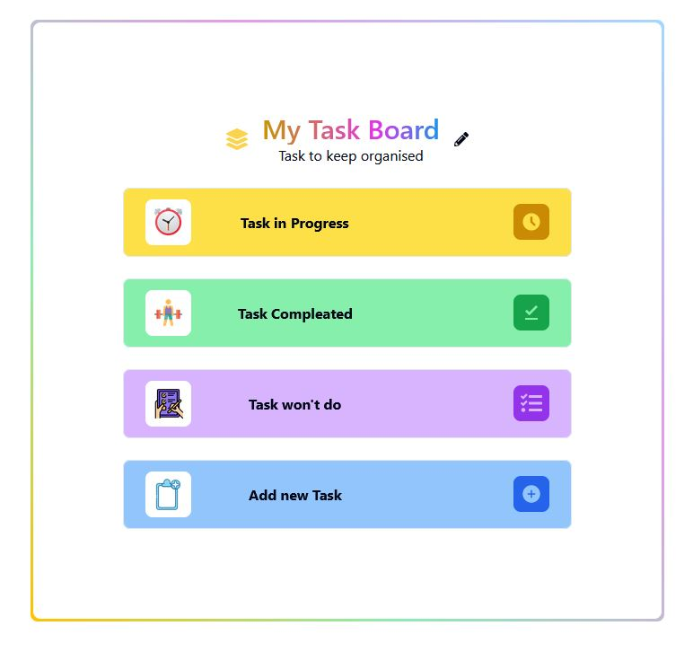

<br/>
<div align="center">

<h3 align="center">My Task Board</h3>
<p align="center">
Streamline Your Tasks with Ease: Your Task Board Solution!

</p>
</div>

## About The Project



The Task Board application is a straightforward task management system designed to facilitate the organization and management of tasks. It provides users with essential functionalities such as creating, reading, updating, and deleting tasks, implemented through HTTP methods like GET, POST, PUT, and DELETE.

### Built With

- [React](https://reactjs.org)
- [TypeScript](https://www.typescriptlang.org/docs/)
- [shadcn UI](https://ui.shadcn.com/)
- [Tainwincss](https://tailwindcss.com/)

## Getting Started

These instructions will get you a copy of the project up and running on your local machine for development and testing purposes.

### Prerequisites

What things you need to install the software and how to install them:

- Node.js
- npm
  ```sh
  npm install npm@latest -g
  ```

### Installation

A step by step series of examples that tell you how to get a development environment running:

1. Clone the repo: `https://github.com/AlNomanCSE/my_task_borad-typescript.git`
2. Install NPM packages: `npm install`
3. Run the app: `npm start`
